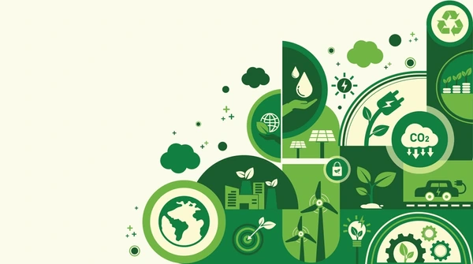

# 1.1. Introducción

Sostenibilidad es desarrollar la manera de satisfacer las necesidades del presente sin comprometer la capacidad de las futuras generaciones, garantizando el equilibrio entre el crecimiento económico, el cuidado del medio ambiente y el bienestar social. La supervivencia de nuestra sociedad y de nuestro planeta pasa por un mundo más sostenible. 

El desarrollo sostenible es un concepto que aparece por primera vez en 1987 con la publicación del Informe Brundtland, que alertaba de las consecuencias medioambientales negativas del desarrollo económico y la globalización y trataba de buscar posibles soluciones a los problemas derivados de la industrialización y el crecimiento de la población.

Podemos hablar de tres tipos de sostenibilidad: 

**SOSTENIBILIDAD AMBIENTAL**
La sostenibilidad ambiental, quizás es la más conocida, hace referencia a la protección del medioambiente, la reducción de la huella de carbono, la explotación de los recursos naturales de una manera responsable y la conservación de los ecosistemas.

**SOSTENIBILIDAD ECONÓMICA**
Se basa en la capacidad de cualquier organización de administrar los recursos propios y financieros para generar rentabilidad a largo plazo de manera responsable.

**SOSTENIBILIDAD SOCIAL**
Se centra en asegurar que todas las personas tengan acceso a los recursos y servicios fundamentales para vivir con dignidad. Busca promover la igualdad de género, garantizar el acceso universal a la salud y la educación, erradicar la pobreza, proteger los derechos humanos, y fomentar una sociedad inclusiva y equitativa. El objetivo principal es mejorar la calidad de vida de las personas, asegurando que todos tengan las mismas oportunidades y puedan participar activamente en la vida social y económica, sin discriminación. 
